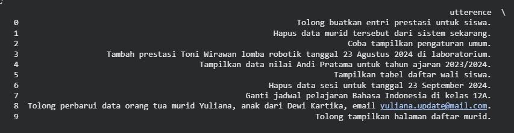

## EN
---
## 💾 Datasets & Preprocessing

This directory contains the raw and processed datasets used to train the UChat NLU Engine, along with the scripts used for data cleaning and augmentation.

The data strategy is the core differentiator between the two model versions.

---

## 📂 Dataset Files

| Filename | Version | Description |
| :--- | :--- | :--- |
| **`fm_dataset.csv`** | **v2.0 Focus Mode** | The curated MVP dataset. Contains **1,600+ utterances** covering 16 specific intents (approx. 100 samples/class). |
| **`dataset.csv`** | **v1.0 Legacy Mode** | The initial experimental dataset. Contains diverse utterances covering **114 intents**. Prone to class imbalance and noise. |

---

## 🛠️ Preprocessing Workflow

The `preprocessing_script.ipynb` notebook handles the transition from raw text to model-ready input. Key steps include:

1.  **Text Normalization:** Lowercasing, removing special characters/regex.
2.  **Label Encoding:** Converting string labels (e.g., `student_chart_nilai`) into integers.
3.  **Data Balancing:** Strategies to mitigate class imbalance (as seen below).

### Visualizations
The images below illustrate the dataset distribution state during the engineering process:

| Before Preprocessing | After Preprocessing |
| :---: | :---: |
|  |  |
| *Initial text utterences* | *Final utterences for training* |

---

## 🎯 Focus Mode Scope (16 Intents)

The v2.0 dataset is strictly scoped to these high-value interactions, categorized by user role:

### 🎓 Student (Murid)
* `student_chart_nilai` — View grade analytics.
* `student_chart_kehadiran` — View attendance analytics.
* `student_achivement` — View personal achievements.
* `student_scores_view` — Navigation to scores page.
* `student_attendants_view` — Navigation to attendance page.

### 👨‍🏫 Teacher (Guru)
* `teacher_view_student_details` — Lookup student profile.
* `teacher_schedule_view` — Check teaching schedule.
* `teacher_score_view` — Navigation to grading input.

### 👨‍👩‍👧 Parent (Wali Murid)
* `parents_student_chart_nilai` — Monitor child's grades.

### 🛡️ Admin
* `admin_student_chart_nilai` — Analytics for specific students.
* `admin_student_cek_kehadiran` — Check specific attendance logs.
* `admin_redirect_home` — Reset/Home.
* `admin_redirect_student_view` — Manage students.
* `admin_redirect_teacher_view` — Manage teachers.
* `admin_log_activity` — View system logs.
* `admin_settings` — System configuration.

> **Note for Legacy Mode:** The v1.0 dataset covers 114 intents including CRUD operations (`_add`, `_update`, `_delete`) for all entities. Please refer to `dataset.csv` for the full schema.

---
## ID
---

Direktori ini berisi dataset mentah dan yang telah diproses untuk melatih UChat NLU Engine, beserta skrip yang digunakan untuk pembersihan dan augmentasi data.

Strategi data adalah pembeda utama antara kedua versi model.

---

## 📂 File Dataset

| Nama File | Versi | Deskripsi |
| :--- | :--- | :--- |
| **`fm_dataset.csv`** | **v2.0 Focus Mode** | Dataset MVP terkurasi. Berisi **1.600+ ujaran** mencakup 16 intent spesifik (~100 sampel/kelas). Sangat diperkaya dengan variasi slang, typo, dan formal. |
| **`dataset.csv`** | **v1.0 Legacy Mode** | Dataset eksperimental awal. Berisi ujaran beragam mencakup **114 intent**. Rentan terhadap ketidakseimbangan kelas dan *noise*. |

---

## 🛠️ Alur Kerja Preprocessing

Notebook `preprocessing_script.ipynb` menangani transisi dari teks mentah menjadi input siap-model. Langkah kuncinya meliputi:

1.  **Normalisasi Teks:** *Lowercasing*, penghapusan karakter khusus/regex.
2.  **Label Encoding:** Mengubah label string (misal: `student_chart_nilai`) menjadi integer.
3.  **Penyeimbangan Data:** Strategi untuk memitigasi ketimpangan kelas (seperti terlihat di bawah).

### Visualisasi
Gambar di bawah mengilustrasikan kondisi distribusi dataset selama proses rekayasa data:

| Sebelum Preprocessing | Sesudah Preprocessing |
| :---: | :---: |
|  |  |
| *Distribusi awal (Potensi Imbalance/Noise)* | *Distribusi akhir siap latih* |

---

## 🎯 Cakupan Focus Mode (16 Intent)

Dataset v2.0 dibatasi secara ketat pada interaksi bernilai tinggi ini, dikategorikan berdasarkan peran pengguna:

### 🎓 Murid
* `student_chart_nilai` — Melihat analisis nilai.
* `student_chart_kehadiran` — Melihat analisis kehadiran.
* `student_achivement` — Melihat prestasi pribadi.
* `student_scores_view` — Navigasi ke halaman nilai.
* `student_attendants_view` — Navigasi ke halaman kehadiran.

### 👨‍🏫 Guru
* `teacher_view_student_details` — Mencari profil murid.
* `teacher_schedule_view` — Cek jadwal mengajar.
* `teacher_score_view` — Navigasi ke input nilai.

### 👨‍👩‍👧 Wali Murid
* `parents_student_chart_nilai` — Memantau nilai anak.

### 🛡️ Admin
* `admin_student_chart_nilai` — Analitik untuk murid tertentu.
* `admin_student_cek_kehadiran` — Cek log kehadiran spesifik.
* `admin_redirect_home` — Reset/Home.
* `admin_redirect_student_view` — Kelola murid.
* `admin_redirect_teacher_view` — Kelola guru.
* `admin_log_activity` — Lihat log sistem.
* `admin_settings` — Konfigurasi sistem.

> **Catatan untuk Legacy Mode:** Dataset v1.0 mencakup 114 intent termasuk operasi CRUD (`_add`, `_update`, `_delete`) untuk semua entitas. Silakan merujuk ke `dataset.csv` untuk skema lengkapnya.
